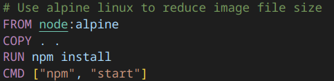
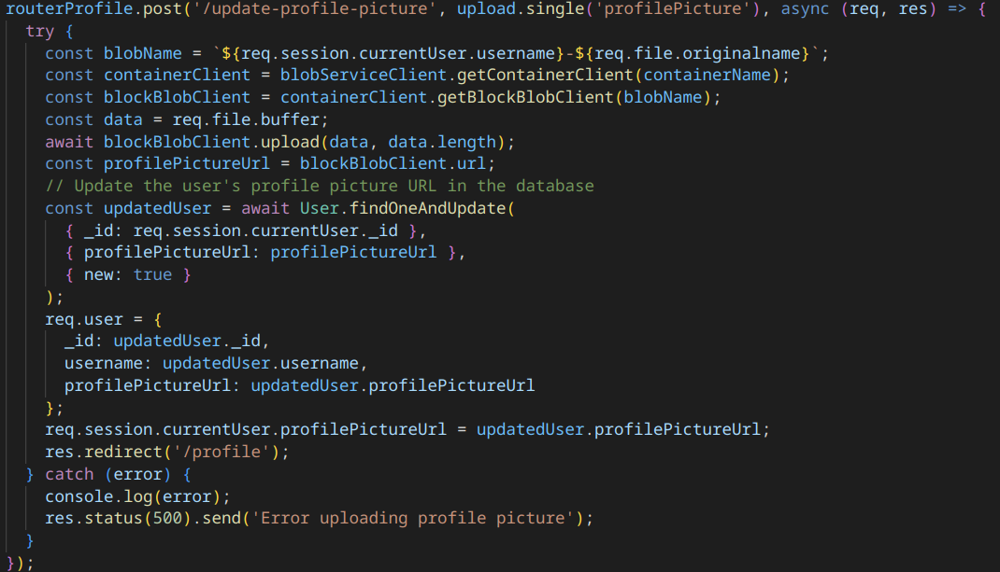

# Compte Rendu Projet Cloud

## Introduction

L'objectif de ce projet est de mettre en place un site web fonctionnel sur une plateforme proposant divers services liés au Cloud.

Etapes à suivres pour le déploiement:

### Etape 1 : Mise en place d'un conteneur Docker

La première étape consiste à mettre en place un conteneur Docker et de le faire fonctionner.
Tout d'abord, je me suis rendu dans **Azure Container Registry** pour créer un registre de conteneurs permettant de stocker mes images Docker, j'ai également dû créer un "Resource group" permettant de grouper tous les services liés à un même application.

Ensuite, j'ai créer un projet en local en utilisant Node.js et en y ajoutant le framework Express qui permet de développer de petites application web dynamiques.

Une fois le serveur Node.js configuré, j'ai créer un fichier Dockerfile, ce fichier contient les instructions permettant de créer une image Docker, voici ce que contient le fichier Dockerfile:

**FROM** correspond à l'image de base qui sera utilisé pour faire l'image Docker, ici node correspond à node.js et alpine correspond au système d'exploitation Alpine Linux qui est axé sur la légèreté et permet ainsi de reduire la taille de l'image.

**COPY** permet de copier les fichiers de l'application web dans le conteneur

**RUN** permet d'executer des commandes durant la construction de l'image, ici npm install permet d'installer toutes les dépendances necessaires au fonctionnement de l'application web

**CMD** permet d'executer des commandes à chaque fois que le conteneur est lancé, ici npm start permet de lancer le serveur web

Une fois le fichier Dockerfile fini, j'ai dû configurer docker pour qu'il puisse se connecter à mon container registry, voici la commande permettant de le faire:

sudo docker login containerchaubet.azurecr.io

Pour récupérer les identifiants, j'ai dû aller dans "Access Key" :

 

Ensuite j'ai dû construire l'image avec la commande suivante:

sudo docker build -t containerchaubet.azurecr.io/cloud-server:latest

Et pour finir j'ai dû pusher l'image vers le container registry:

sudo docker push containerchaubet.azurecr.io/cloud-server:latest

### Etape 2 : Mise en place d'une App Service

Maintenant que l'image docker est energistré sur Azure, il faut un serveur pour pourvoir la faire fonctionner, pour cela, j'ai dû créer une **Azure App Service** qui est une plateforme qui fournit des services pour le déploiement et la mise à l'echelle (scaling) d'application ou de services web.

Une fois la Azure App Service crée, j'ai dû configurer le déploiement en continu pour qu'elle puisse mettre en place l'image docker, voici la page de configuration permettant de configurer l'App Service sur le bon Container Registry et sur la bonne image:

 

Une fois la configuration terminée, l'application est désormais accessible sur le web.

### Etape 3 : Mise en place d'une base de données CosmosDB

Cette troisième étape consiste à mettre en place une base de données en utilisant le service **Azure CosmosDB**

Lors de la création de la base, plusieurs choix d'API sont proposés tels que PostgresSQL, MongoDB ...

Pour ce projet, j'ai séléctionné MongoDB car c'est un SGBD que j'ai déja utilisé et qui permet également d'enregistrer des documents tel que des articles de blog

Ensuite, toujours lors de la création de la base, pour le "Capacity Mode", j'ai eu le choix entre "Provisioned throughput" ou "Serverless", le premier choix est le mieux adapté pour une charge de travail soutenue avec traffic important tandis que le mode "Serverless" est le mieux adapté pour une charge de travail avec traffic intermittant ou imprévisible. J'ai donc choisis le mode "Serverless" qui est le mieux adapté pour un petit site web, d'autant qu'il coûte moins cher.

Une fois que la base de données a été crée, j'ai récupérer les identifiants et j'ai configuré Mongoose qui est une extension JavaScript installable avec npm et je l'ai connecté avec la base de données hébérgée sur Azure CosmosDB.
J'ai ensuite lancé mon serveur qui a pu créer automatiquement créer les collections "articles" permettant d'enregister les articles de blog et "users" qui permet d'enregister les utilisateurs.
 
 
Voici une capture d'écran montrant un article enregistré dans la base de données:

 

## Etape 4 : Mise en place d'Azure Storage

Pour cette dernière étape, j'ai mis en place un stockage pour permettre aux utilisateur de mettre une photo de profil en utilisant **Azure Storage**

Pour commencé, j'ai créer un Storage account, au niveau de la Performance, j'ai eu le choix entre Standard ou Premium, étant donné qu'il s'agit d'un petit site web j'ai choisis Standard car je n'ai pas besoin d'acceder au stockage avec une faible latence et une grosse bande passante (de plus il s'agit d'images donc des fichiers pas trop lourd).

Une fois le storage account configuré, j'ai dû créer un **Blob Container** permettant de regrouper les photos de profil dans un même conteneur

Une fois le stockage créer, j'ai du configurer mon application web pour qu'elle puisse enregister chaque photo de profil, pour cela j'ai utilisé l'API **@azure/storage-blob** qui est l'API officielle d'Azure permettant d'enregister des images dans le stockage Azure, ensuite j'ai également utilisé l'API multer permettant de récupérer l'image envoyé par l'utilisateur afin de la transmettre directement au stockage, voici une capture d'écran du code permettant de faire cela:

## Motivations pour le choix de la solution Cloud d'Azure

J'ai décidé d'utiliser les services proposés par Microsoft Azure pour plusieurs raisons:

- Offre Etudiante: lors de la création du compte, Azure offrait 100€ pour tout étudiant utilisant son service, j'ai donc profité de cette offre pour mettre en place mon application web.
- Qualité des tutoriels mis à disposition: Beaucoup de tutoriels sont disponibles sur Internet et m'ont permis de bien prendre en main l'interface d'Azure mais également de bien configurer chaque service pour mon applicaton web.
- Diversité des services proposés:
    - Container Registry: ce service m'a permis de stocker et de gérer mon image docker
    - App Service: ce service m'a permis de deployer facilement mon application Node.js notamment grâce à l'integration facile avec Container Registry qui permet de selectionner l'image ainsi que la version de l'image pour le deploiement
    - CosmosDB: ce service m'a permis de mettre en place une base de données NoSQL avec MongoDB permettant de stocker les articles de blog ainsi que la création d'utilisateurs
    - Azure Storage: ce service m'a permis de stocker facilement grâce à l'API azure-storage-blob pour node.js des fichiers notamment les photos de profil des utilisateurs